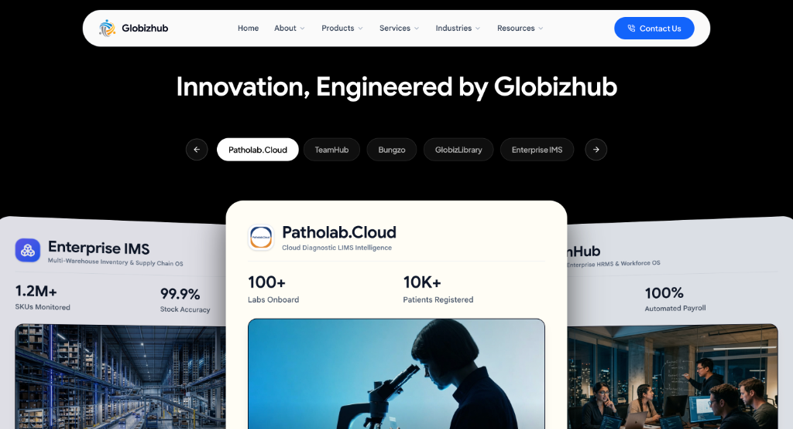

# Globizhub India Private Limited



[](https://gipl-website.vercel.app)
[](https://nextjs.org/)
[](https://www.typescriptlang.org/)
[](https://tailwindcss.com/)
[](https://gipl-website.vercel.app)

Official enterprise web portal and digital ecosystem for **Globizhub India Private Limited (GIPL)**, an ISO-certified technology engineering and systems architecture conglomerate based in Bengaluru, Karnataka and Guwahati, Assam.

---

## Executive Overview

Globizhub India Private Limited engineers resilient digital platforms, autonomous AI systems, and mission-critical cloud infrastructure for healthcare, enterprise operations, logistics, and supply chain domains.

- **Corporate Identification Number (CIN)**: U72900AS2021PTC021966
- **Accreditations & Certifications**:
  - ISO 9001:2015 (Quality Management Systems)
  - ISO 27001:2022 (Information Security Management)
  - ISO 20000-1:2018 (IT Service Management)
  - DPIIT Recognized Enterprise
  - Startup India & Assam Startup Accredited
  - Ministry of MSME Certified (Udyam)
- **Live Production URL**: [https://gipl-website.vercel.app](https://gipl-website.vercel.app)

---

## Core Product Portfolio

Globizhub develops and maintains six proprietary enterprise platforms:

### 1. Patholab.Cloud
- **Category**: Cloud Diagnostic LIMS Intelligence
- **Focus**: End-to-end Laboratory Information Management System (LIMS) for clinical pathology laboratories, hospital diagnostic networks, and multi-branch sample processing.
- **Key Metrics**: 100+ Labs Onboarded, 10K+ Registered Patients, 99.98% System Availability.
- **Capabilities**: Automated instrument interfacing, bidirectional barcode tracking, NABL-compliant reporting, instant patient WhatsApp/SMS dispatch.

### 2. TeamHub
- **Category**: Enterprise HRMS & Workforce OS
- **Focus**: Unified human resource management platform designed for scaling enterprises and modern distributed workforces.
- **Key Metrics**: 100% Automated Payroll Computation, 99.9% Attendance Accuracy, Multi-Entity Governance.
- **Capabilities**: Biometric device synchronization, automated statutory compliance, appraisal workflows, leave governance, and self-service portals.

### 3. Bungzo
- **Category**: Food Logistics & Hyperlocal Delivery Platform
- **Focus**: High-efficiency culinary commerce, digital ordering, and dispatch optimization engine.
- **Key Metrics**: Ultra-low order dispatch latency, real-time rider routing, 99.8% Order Fulfillment Rate.
- **Capabilities**: Merchant dashboard, real-time telemetry, automated kitchen display systems, and consumer mobile applications.

### 4. GlobizLibrary
- **Category**: Enterprise Digital Knowledge & Institutional Intelligence
- **Focus**: Centralized digital asset management, institutional repository, and document intelligence platform for universities, enterprises, and research organizations.
- **Capabilities**: Semantic indexing, role-based access control, automated citation generation, and compliance document archiving.

### 5. Enterprise IMS
- **Category**: Multi-Warehouse Inventory & Supply Chain OS
- **Focus**: Real-time inventory tracking, procurement automation, and warehouse lifecycle operations.
- **Key Metrics**: 1.2M+ SKUs Monitored, 99.9% Stock Accuracy.
- **Capabilities**: Multi-location batch tracking, automated reorder thresholds, audit logging, and ERP integration adapters.

### 6. Globizhub Listing
- **Category**: Global B2B Trade & Sourcing Directory
- **Focus**: High-efficiency B2B trade marketplace, supplier discovery platform, and manufacturing procurement directory connecting verified enterprises with global buyers.
- **Key Metrics**: 50K+ Verified Suppliers, 150+ Product Categories, Multi-Region Trade Networks.
- **Capabilities**: Category-wise RFQ submissions, verified seller cataloging, international trade matchmaking, and direct supplier inquiry dispatch.
- **Platform URL**: https://listing.globizhub.com/

---

## Technology Stack

The platform is constructed with modern web architecture adhering to high standards of performance, security, and responsive design:

- **Core Framework**: Next.js 15 (App Router, Server Components, Streaming SSR)
- **Runtime & Language**: React 19, TypeScript (Strict Type Checking)
- **Styling Architecture**: Vanilla CSS & Tailwind CSS with curated design tokens
- **Typography**: Google Sans, Plus Jakarta Sans, Space Grotesk, Inter, IBM Plex Mono
- **Component Primitives**: Lucide Icons, Custom Accessible Micro-Interactions
- **Analytics & Observability**: Integrated Privacy-First Telemetry
- **Production Infrastructure**: Vercel Global Edge Network with SSL/TLS encryption and automatic asset optimization

---

## Project Structure

```
.
├── public/
│   ├── favicon.ico
│   ├── favicon.svg
│   ├── apple-touch-icon.png
│   └── images/
│       ├── readme-showcase.png      # High-resolution README platform banner
│       ├── og-social-preview.png    # Open Graph 1200x630 social preview (PNG)
│       ├── og-social-preview.jpg    # Open Graph 1200x630 social preview (JPEG)
│       ├── globizhub_official_logo.png
│       ├── patholab_logo.png
│       ├── bungzo_logo.png
│       └── ...
├── src/
│   ├── app/
│   │   ├── layout.tsx               # Root layout, fonts, and Open Graph metadata
│   │   ├── page.tsx                 # Enterprise homepage composition
│   │   ├── globals.css              # Design tokens and global utility styles
│   │   ├── opengraph-image.png      # Next.js automatic Open Graph image asset
│   │   └── twitter-image.png        # Next.js automatic Twitter card image asset
│   ├── components/
│   │   ├── layout/                  # SiteHeader, MegaMenu, MobileMenu, Footer
│   │   ├── marketing/               # Hero, InnovationProductShowcase, EnterpriseFAQ, etc.
│   │   └── shared/                  # Common enterprise UI primitives and modals
│   └── lib/                         # Navigation data, contracts, and utility functions
├── package.json
├── tsconfig.json
└── README.md
```

---

## Getting Started

### Prerequisites

Ensure the following tools are installed locally:
- Node.js (v18.17.0 or higher recommended)
- npm (v9.0.0 or higher) or yarn

### Installation

1. Clone the repository:
   ```bash
   git clone https://github.com/anupam-codespace/GIPL-WebSite.git
   cd GIPL-WebSite
   ```

2. Install dependencies:
   ```bash
   npm install
   ```

3. Start the local development server:
   ```bash
   npm run dev
   ```

4. Open your browser and navigate to:
   ```
   http://localhost:3000
   ```

### Building for Production

Compile and validate the static generation pipeline:

```bash
npm run build
npm run start
```

---

## Open Graph & Social Sharing

The web application is configured with Open Graph and Twitter Card metadata for link previews across messaging and social platforms including WhatsApp, LinkedIn, X (Twitter), Facebook, Slack, Telegram, and iMessage:

- **Open Graph Image**: `1200 x 630` pixels (PNG & JPEG formats under 300 KB for rapid mobile unfurling)
- **Canonical Sharing Target**: `https://gipl-website.vercel.app`
- **Dynamic Headers**: Pre-rendered via Next.js metadata API to ensure crawlers receive preview tags on the initial HTTP response

---

## Revamp Attribution

Website revamp is done under Anupam Saha (OneXmedia.Studio)
